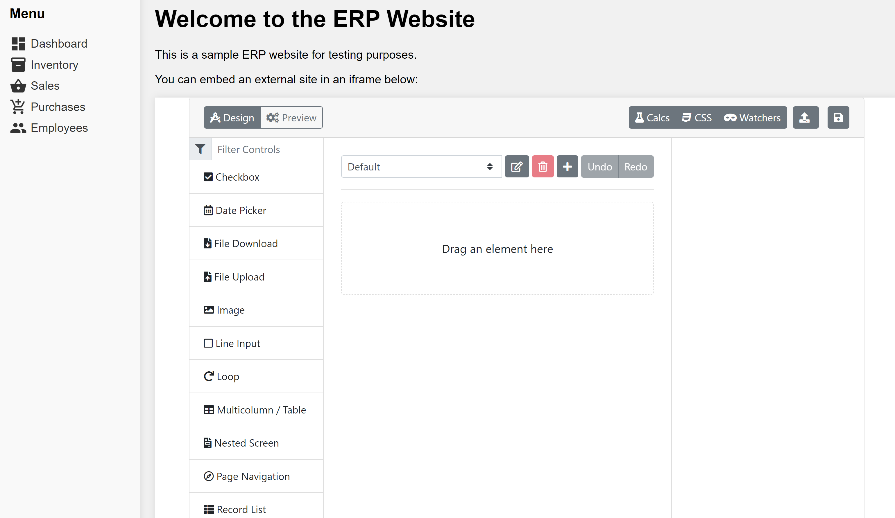

# Embedding Screen Builder via iFrame Method

## Overview

This guide discusses the process of embedding ProcessMaker's Screen Builder into a Web application using an iFrame.&#x20;

## Steps to Embed Screen Builder

By following the steps below, seamlessly integrate Screen Builder into your application.

### Step 1: Generate the iFrame Embed Code

To embed Screen Builder, generate the iFrame embed code. The embed code should include the URL of the Screen Builder application. For example, if Screen Builder is hosted locally on your machine at `<http://localhost:8080>`, use the following HTML code:

```html
<!DOCTYPE html>
<html lang="en">
<head>
  <meta charset="UTF-8" />
  <meta name="viewport" content="width=device-width, initial-scale=1.0" />
  <title>ERP Website</title>
  <link rel="stylesheet" href="https://fonts.googleapis.com/icon?family=Material+Icons" />
  <style>
    /* CSS styles for the ERP website */
    * {
      box-sizing: border-box;
    }

    body {
      margin: 0;
      padding: 0;
      font-family: Arial, sans-serif;
      background-color: #f1f1f1;
    }

    .container {
      display: flex;
    }

    .sidebar {
      background-color: #f9f9f9;
      width: 200px;
      padding: 20px;
      box-shadow: 0 0 10px rgba(0, 0, 0, 0.1);
    }

    .sidebar h3 {
      margin-top: 0;
    }

    .sidebar ul {
      list-style-type: none;
      padding: 0;
      margin: 10px 0;
    }

    .sidebar li {
      margin-bottom: 5px;
    }

    .sidebar a {
      text-decoration: none;
      color: #333;
      display: flex;
      align-items: center;
    }

    .sidebar .material-icons {
      margin-right: 5px;
    }

    .content {
      flex-grow: 1;
      padding: 20px;
    }

    h1 {
      margin-top: 0;
    }

    iframe {
      width: 100%;
      height: 600px;
      border: none;
      box-shadow: 0 0 10px rgba(0, 0, 0, 0.1);
    }
  </style>
</head>
<body>
  <div class="container">
    <!-- Sidebar -->
    <div class="sidebar">
      <h3>Menu</h3>
      <ul>
        <li>
          <a href="#"><i class="material-icons">dashboard</i> Dashboard</a>
        </li>
        <li>
          <a href="#"><i class="material-icons">inventory</i> Inventory</a>
        </li>
        <li>
          <a href="#"><i class="material-icons">shopping_basket</i> Sales</a>
        </li>
        <li>
          <a href="#"><i class="material-icons">add_shopping_cart</i> Purchases</a>
        </li>
      </ul>
    </div>

    <!-- Main Content Area -->
    <div class="content">
      <h1>Welcome to the ERP Website</h1>
      <p>This is a sample ERP website for testing purposes.</p>
      <p>You can embed an external site in an iframe below:</p>
      <iframe src="http://localhost:8080/" style="height:1000px;" frameborder="0"></iframe>
    </div>
  </div>
</body>
</html>
```

### Step 2: Integrate the iFrame Code into Your Web Application

Identify the appropriate location within your Web application to embed Screen Builder. This could be a specific page, a modal window, or any other suitable area. Insert the provided HTML code, including the iFrame, into the desired location in your HTML file.

### Step 3: Customize the iFrame Attributes (Optional)

You can customize the attributes of the iFrame according to your requirements. For example, you can adjust the width, height, frameborder, and other attributes of the iFrame to fit your application's design and layout.

### Step 4: Test and Verify the Integration

Save your changes and reload your Web application. Ensure that the embedded Screen Builder is visible and functioning correctly within your application. Test the functionality of Screen Builder, such as creating Screens, adding elements, and configuring properties, to ensure that everything works as expected.

#### Output Preview: Embedded ProcessMaker Screen Builder

After you have completed the steps above, verify ProcessMaker's Screen Builder is embedded to your Web application.

<figure><figcaption><p>Screen Builder Embedded in a Web Application</p></figcaption></figure>

## Conclusion

By following the steps outlined in this guide, you can integrate the ProcessMaker's powerful Screen Builder into your Web application using an iFrame.
