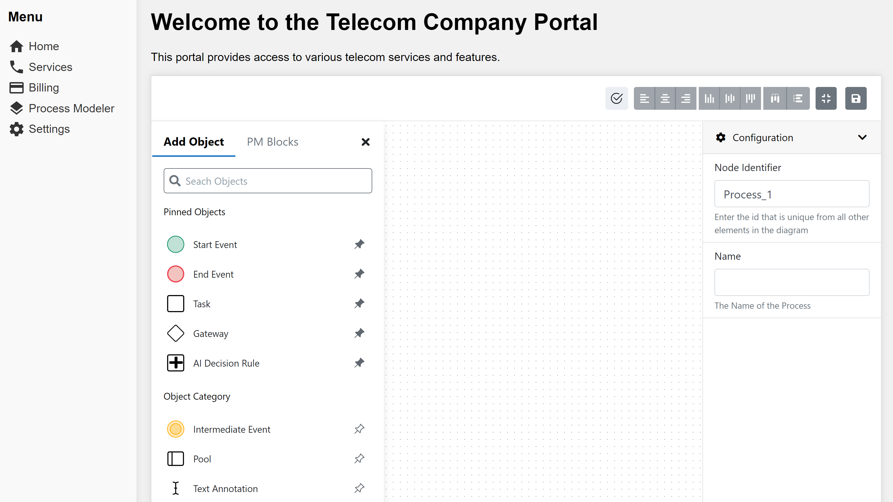

# Embedding the Modeler via iFrame Method

## Overview

In this guide, we will walk you through the process of embedding the [ProcessMaker Modeler](https://github.com/ProcessMaker/modeler) into a web application using an iFrame.&#x20;

## Steps to Embed the Modeler

By following the steps below, you will be able to seamlessly integrate the Modeler into a web application.

### Step 1: Generate the iFrame Embed Code

To embed the Modeler, you will need to generate the iFrame embed code. The embed code should include the URL of the Modeler application. For example, if the Modeler is hosted locally on your machine at `<http://localhost:8080>`, you can use the following HTML template:

```html
<!DOCTYPE html>
<html lang="en">
<head>
  <meta charset="UTF-8" />
  <meta name="viewport" content="width=device-width, initial-scale=1.0" />
  <title>Telecom Company Portal</title>
  <link rel="stylesheet" href="https://fonts.googleapis.com/icon?family=Material+Icons" />
  <style>
    /* CSS styles for the Telecom Company Portal */
    * {
      box-sizing: border-box;
    }

    body {
      margin: 0;
      padding: 0;
      font-family: Arial, sans-serif;
      background-color: #f1f1f1;
    }

    .container {
      display: flex;
    }

    .sidebar {
      background-color: #f9f9f9;
      width: 200px;
      padding: 20px;
      box-shadow: 0 0 10px rgba(0, 0, 0, 0.1);
    }

    .sidebar h3 {
      margin-top: 0;
    }

    .sidebar ul {
      list-style-type: none;
      padding: 0;
      margin: 10px 0;
    }

    .sidebar li {
      margin-bottom: 5px;
    }

    .sidebar a {
      text-decoration: none;
      color: #333;
      display: flex;
      align-items: center;
    }

    .sidebar .material-icons {
      margin-right: 5px;
    }

    .content {
      flex-grow: 1;
      padding: 20px;
    }

    h1 {
      margin-top: 0;
    }

    iframe {
      width: 100%;
      height: 600px;
      border: none;
      box-shadow: 0 0 10px rgba(0, 0, 0, 0.1);
    }
  </style>
</head>
<body>
  <div class="container">
    <!-- Sidebar -->
    <div class="sidebar">
      <h3>Menu</h3>
      <ul>
        <li>
          <a href="#"><i class="material-icons">home</i> Home</a>
        </li>
        <li>
          <a href="#"><i class="material-icons">phone</i> Services</a>
        </li>
        <li>
          <a href="#"><i class="material-icons">credit_card</i> Billing</a>
        </li>
        <li>
            <a href="#"><i class="material-icons">layers</i>Process Modeler</a>
          </li>
        <li>
            <a href="#"><i class="material-icons">settings</i> Settings</a>
        </li>
      </ul>
    </div>

    <!-- Main Content Area -->
    <div class="content">
      <h1>Welcome to the Telecom Company Portal</h1>
      <p>This portal provides access to various telecom services and features.</p>
      <iframe src="http://localhost:8080/" style="height:1000px;" frameborder="0"></iframe>
    </div>
  </div>
</body>
</html>
```

### Step 2: Integrate the iFrame Code into Your Web Application

Identify the appropriate location within your web application to embed the Modeler. This could be a specific page, a modal window, or any other suitable area. Insert the provided HTML code, including the iFrame, into the desired location in your HTML file.

### Step 3: Customize the iFrame Attributes (Optional):

You can customize the attributes of the iFrame according to your requirements. For example, you can adjust the width, height, frameborder, and other attributes of the iFrame to fit your application's design and layout.

### Step 4: Test and Verify the Integration

Save your changes and reload your web application. Ensure that the embedded Modeler is visible and functioning correctly within your application. Test the functionality of the Modeler, such as drawing a process, adding elements, and configuring properties, to ensure that everything works as expected.

#### Output Preview: Embedded ProcessMaker Modeler

Once you have completed the steps above, you should be able to see the embedded Modeler in action.

<figure><figcaption><p>Modeler Embedded in a Web Application</p></figcaption></figure>

## Conclusion

In conclusion, this guide offers a seamless solution for developers seeking to integrate the robust ProcessMaker's Modeler into their web applications. By providing a clear example of embedding the Modeler into an iFrame, this guide simplifies the integration process and enables developers to effortlessly incorporate the powerful functionalities of the ProcessMaker Modeler within their own applications.
