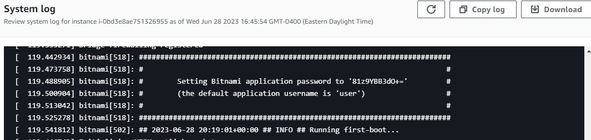

# Cloud Quick Start (Bitnami)

## Overview

This guide will walk you through the steps to install and configure [ProcessMaker Community using Bitnami on Amazon AWS](https://bitnami.com/stack/processmaker/cloud/aws/amis) cloud platform. By following this guide, you will have a fully functional instance of ProcessMaker Community, a powerful, open-source business process management (BPM) and workflow software.

## Prerequisites


Please note that in order to set up a new instance, you will need an AWS account with sufficient permissions. It is important to ensure that your AWS account has the necessary privileges to create and configure instances, as well as manage associated resources.


| Requirement        | Function                                                                                                                                                           |
| ------------------ | ------------------------------------------------------------------------------------------------------------------------------------------------------------------ |
| Amazon AWS Account | AWS provides a highly scalable and reliable infrastructure, allowing users to access on-demand computing resources, storage, databases, and other functionalities. |

### Step 1: Select the AWS Cloud Platform

Go to this link: [https://bitnami.com/stack/processmaker/cloud/aws/amis](https://bitnami.com/stack/processmaker/cloud/aws/amis)

Select the region where you wish to host ProcessMaker and initiate the deployment process.&#x20;

<figure><figcaption>
AWS Region to launch an instance
</figcaption></figure>

### Step 2: Configure your Instance

1. Specify the desired name for your instance, as illustrated in the example below. This name will help you easily identify and manage your instance within your cloud platform environment.

<figure><figcaption>
Define name and tags
</figcaption></figure>

2. Choose the appropriate instance type that best suits your needs.&#x20;


The instance type determines the computing resources allocated to your ProcessMaker installation, such as CPU, memory, and storage capacity. Carefully consider the requirements of your workload and select an instance type that provides optimal performance and scalability for your ProcessMaker deployment.


<figure><figcaption>
Instance type
</figcaption></figure>

3. Ensure the security of your instance by selecting a Key Pair that will allow you to establish secure connections. Choose an existing Key Pair or create a new one to establish a secure connection.


A Key Pair consists of a public and private key, and it is essential for securely accessing and managing your instance


<figure><figcaption>
Key Pair
</figcaption></figure>

4. Configure the network settings for your ProcessMaker instance. Ensure that the network settings align with your desired networking environment and security requirements to enable seamless communication and access to your ProcessMaker instance.

<figure><figcaption>
Network Settings
</figcaption></figure>

5. Choose your desired storage capacity.

<figure><figcaption>
Configure storage
</figcaption></figure>

6. Initiate the launch process for your instance. Click on the **Launch instance** button.

.png>)

7. After launching your instance, locate and click on the instance ID associated with your ProcessMaker deployment.&#x20;


The instance ID serves as a unique identifier for your instance within your cloud platform's management console. By clicking on the instance ID, you can access detailed information and perform various management tasks, such as monitoring resource usage, adjusting configurations, and troubleshooting any potential issues related to your instance.


<figure><figcaption></figcaption></figure>

Please allow a few minutes for the instance initialization process to complete. Once the Instance state transitions to "Running," it indicates that your ProcessMaker instance is ready for access.

<figure><figcaption>
Instance Running
</figcaption></figure>

### Step 3: Retrieve your Credentials

1. Select your instance.
2. Navigate to the "Actions" menu and choose "Monitor and troubleshoot" or a similar option.
3. Look for the "Get system log" or a similar option within the available actions.
4. Click on "Get system log" to retrieve the system log information associated with your instance.&#x20;
5. Examine the logs to find your ProcessMaker login credentials. These credentials will enable you to securely log in and begin utilizing the functionalities of ProcessMaker.

<figure><figcaption>
Login Credentials
</figcaption></figure>

### Step 4: Access your ProcessMaker Instance

Choose your instance from the list and locate the Public IPv4 DNS associated with it. Open the provided link in your web browser. You will be directed to the login page of your ProcessMaker instance. Enter your login credentials to gain access to ProcessMaker's interface and start taking advantage of the ProcessMaker capabilities.


This Public IPv4 DNS serves as the unique address that can be used to access your ProcessMaker instance from the internet.


<figure><figcaption>
ProcessMaker Login Screen
</figcaption></figure>

## Conclusion

In conclusion, by following the steps above we successfully set up a ProcessMaker instance in the AWS cloud platform using Bitnami. With the setup complete, you can now fully leverage the robust capabilities of ProcessMaker to enhance your business processes and drive operational efficiency.
